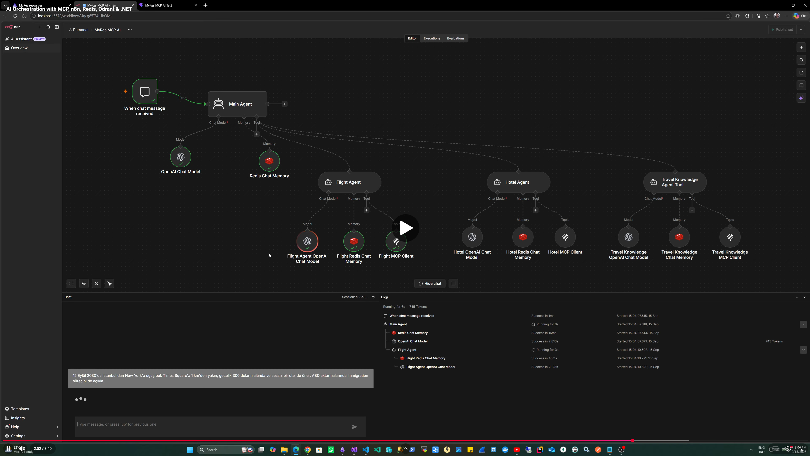

# MyRes-MCP

MyRes-MCP is a pragmatic demonstration of AI orchestration and the Model Context Protocol (MCP). It combines n8n, specialized AI agents, .NET Aspire, Redis, Qdrant, and small .NET services to show how one conversational request can be decomposed, delegated, clarified, and answered with different tools and data sources.

The main scenario combines flight search, hotel search, and travel guidance. The system routes each part to a specialist, preserves conversational context, pauses before tool execution when an airport choice is ambiguous, and combines structured provider results with document-grounded retrieval.

This is not a production reservation platform. Unlike the original [MyRes](https://github.com/erkanozmenli/MyRes) project, it is not primarily a demonstration of Clean Architecture, domain-driven design, exhaustive application practices, or production reservation architecture. Supporting services and sample data are intentionally simple so that AI orchestration, MCP tool use, and agent behavior remain the focus.

## Relationship to MyRes

Conceptually, the n8n orchestration and MCP layer can be viewed as an experimental AI extension of MyRes. It lives in a separate repository because integrating the experiment into MyRes would add unrelated architectural and domain complexity without making the AI/MCP concepts clearer.

## Quick Start

### Prerequisites

- .NET 10 SDK
- Docker Desktop or another Docker-compatible container runtime
- Node.js 22.12 or later and npm
- An OpenAI API key for Travel Knowledge embeddings
- An n8n API key, created during the first-run sequence below

### First run

1. Start the Aspire AppHost from the repository root:

   ```bash
   dotnet run --project MyRes.AppHost
   ```

2. Provide the parameters requested by Aspire:

   - `RedisPassword` secures the local Redis instance.
   - `OpenAIApiKey` is passed to Travel Knowledge for OpenAI `text-embedding-3-small` embeddings and Qdrant vector search.
   - `N8nApiKey` is used only by `MyRes.N8nBootstrap` to call the n8n Public API.

3. On the first run, let n8n start, create an n8n API key, and provide it through Aspire's `N8nApiKey` parameter. Restart the bootstrap resource, or the AppHost, after supplying the key. The bootstrapper then synchronizes the repository workflows with n8n.

4. In n8n, manually configure the credentials referenced by the workflow:

   - **OpenAI** for the Main, Flight, Hotel, and Travel Knowledge agents.
   - **Redis** for their conversation-memory nodes.

   These credentials are separate from the embedding key supplied to Aspire:

   ```text
   Aspire OpenAIApiKey -> Travel Knowledge -> embeddings -> Qdrant
   n8n OpenAI credential -> AI agents and orchestration
   ```

5. Open the frontend URL from the Aspire dashboard. Aspire runs the React/Vite client and configures its n8n chat webhook URL.

`N8nBootstrap` deliberately manages workflow lifecycle only. Credential and provider provisioning remain manual to avoid infrastructure work unrelated to this demo's purpose.

### Local Redis connections

Use the configured `RedisPassword` for both connections.

| Client | Host | Port | Username | TLS / SSL |
| --- | --- | ---: | --- | --- |
| Redis Insight | `host.docker.internal` | `6379` | Leave empty | Enabled |
| n8n Redis credential | `host.docker.internal` | `6380` | Leave empty | Disabled |

The separate endpoints and security modes are intentional for the local container setup: Aspire exposes the primary Redis endpoint through its TLS proxy and a secondary plain TCP endpoint for n8n.

## What Is Included?

| Component | Purpose |
| --- | --- |
| React / Vite frontend | Hosts the streaming n8n chat interface. |
| n8n | Runs the chat trigger, agent orchestration, models, memory, and MCP clients. |
| Main Agent | Decomposes mixed requests and delegates scoped tasks to specialists. |
| Flight Agent | Resolves airports, requests clarification when needed, and searches flights. |
| Hotel Agent | Applies structured hotel filters and interprets returned hotel descriptions. |
| Travel Knowledge Agent | Answers travel questions only from retrieved document chunks. |
| MCP API | Exposes airport, flight, hotel, and travel-knowledge tools over HTTP MCP. |
| Provider Service | Supplies deliberately small in-memory flight and hotel datasets. |
| Travel Knowledge API | Generates query embeddings and searches Qdrant. |
| Redis | Stores airport search data and n8n conversation memory. |
| Qdrant | Stores and searches embedded travel-knowledge chunks. |
| .NET Aspire AppHost | Starts and connects the application projects, containers, and frontend. |
| N8nBootstrap | Creates, updates, and publishes versioned n8n workflows. |

## Architecture Overview


> An interactive Archify version is available at
> `architecture/myres-mcp-runtime.html`.
>
> Clone or download the repository and open this self-contained HTML file locally.

The Archify source of truth is `architecture/myres-mcp-runtime.architecture.json`. The diagram focuses on the runtime request path; provisioning and class-level details are intentionally omitted. The workflow export addresses the MCP API through the host's port `3000`, while Aspire manages the corresponding service resource.

## See It in Action

[](https://youtu.be/ZHKekVFcMwU)

The demo is intended to show the complete mixed-prompt flow:

> Find me a flight from Istanbul to New York on September 15, 2030. Also recommend a quiet hotel within 1 km of Times Square for under $300 per night, and explain the immigration process when connecting through a U.S. airport.

## Key Scenarios

### Multi-Agent Orchestration

The Main Agent treats the prompt as three independent tasks:

```text
Flight request                    -> Flight Agent
Hotel request                     -> Hotel Agent
U.S. immigration/transit question -> Travel Knowledge Agent
```

It sends each specialist only its relevant request and presents their results; its workflow prompt explicitly prevents it from inventing domain answers. Redis-backed chat memory on the Main Agent and each specialist preserves pending work and lets a follow-up airport choice continue the flight task without rerunning completed tasks.

### Human-in-the-Loop Flight Search

The Flight Agent must resolve user-entered locations with `search_airports`; it is instructed never to guess IATA codes. "Istanbul" currently resolves to IST and SAW, while "New York" resolves to JFK, EWR, and LGA. Unless the user explicitly wants all matching airports, the agent returns these candidates and asks for a choice instead of calling `search_flights`. Flight search runs only after both endpoints are unambiguous.

This is a clarification-before-execution pattern: MCP discovers valid options, a person resolves intent, and conversation memory carries that decision into the next turn.

#### Typo-tolerant airport resolution

`AirportSearchService` seeds a small airport set into Redis hashes and creates a RediSearch index. It normalizes case, accents, punctuation, and spacing; tries exact IATA, normalized-name, and normalized-city matches first; then uses RediSearch fuzzy terms for spelling variations and typos.

### Travel Knowledge / RAG

Travel Knowledge follows a small retrieval-augmented generation path:

```text
Question -> OpenAI embedding -> Qdrant similarity search
         -> ranked travel-document chunks -> grounded agent response
```

At startup, the API chunks the embedded sample Markdown documents, generates embeddings with OpenAI `text-embedding-3-small`, and seeds an empty Qdrant `travel-knowledge` collection. Queries use the same model and cosine vector search, with optional country and topic filters. The MCP tool returns ranked chunks; the Travel Knowledge Agent is instructed to answer only from that retrieved content.

The embedding model and vector size form part of the vector-space contract. Changing the model without recreating and re-embedding the stored documents can degrade or invalidate similarity results. The included U.S. passport, transit, and visa documents are demo content, not a production travel or legal knowledge base.

### Structured + Descriptive Hotel Search

The hotel flow keeps deterministic and descriptive constraints separate:

- `price < $300` becomes the `maxPricePerNight` structured filter.
- `within 1 km of Times Square` becomes `maxDistanceToTimesSquareKm`.
- `quiet` is not a structured field. The agent calls `get_hotel_details` for the filtered candidates and evaluates only their returned descriptions.

The Provider Service implements these searches over five static New York hotels. This is enough to demonstrate how an agent can combine precise filtering with grounded interpretation without presenting the sample provider as a live hotel platform.

## n8n Workflow Provisioning

Workflow exports are versioned in `MyRes.AppHost/n8n/workflows`.

```text
Git-versioned workflow JSON
            |
            v
      N8nBootstrap
            |
            v
       n8n Public API
            |
            v
   create / update / publish
```

After n8n becomes ready, `N8nBootstrap` reads the top-level JSON files, matches workflows by name, creates missing workflows, updates existing ones, and publishes those whose checked-in `active` flag is `true`. Duplicate remote names are rejected rather than guessed. Credentials remain outside this synchronization scope.

## Test Scenario

Use this as the primary end-to-end prompt:

> Find me a flight from Istanbul to New York on September 15, 2030. Also recommend a quiet hotel within 1 km of Times Square for under $300 per night, and explain the immigration process when connecting through a U.S. airport.

This one prompt demonstrates three independent behaviors:

1. **Flight:** airport resolution precedes flight search. Multiple origin or destination candidates cause a clarification turn; the search continues after the user selects the intended airports.
2. **Travel Knowledge:** the transit question is routed independently, retrieves relevant sample chunks through Qdrant vector search, and is answered from that retrieved knowledge.
3. **Hotel:** price and Times Square distance are applied as structured filters, while quietness is judged from descriptions fetched for the resulting candidates.

The result is more than passing parameters from an LLM into one MCP tool: the workflow coordinates independent specialists, different tool sequences, conversational state, human clarification, structured data, and retrieval-grounded content.

## Scope and Limitations

- Flight and hotel provider data is static demo data.
- Airport and travel-knowledge datasets are intentionally limited.
- The system is not a production reservation platform and does not provide booking or live inventory.
- Travel Knowledge content is sample material and is not authoritative legal or immigration advice.
- Provider integrations and application layers are intentionally simple to keep attention on AI orchestration and MCP behavior.
- MCP tools and their underlying APIs can be extended or replaced with real providers if the project is evolved beyond the demo.
